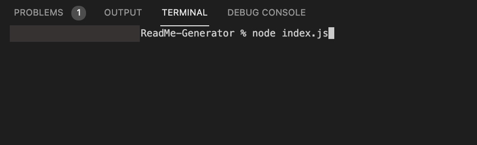
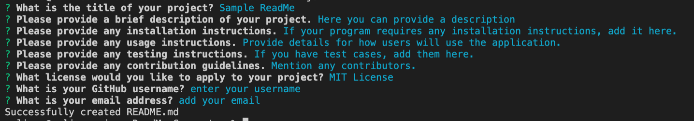
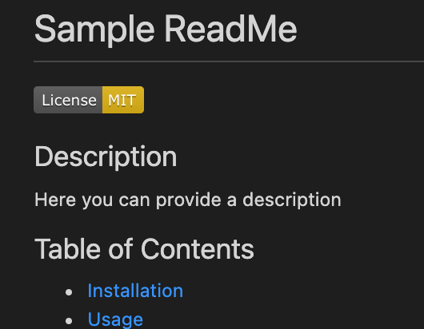

# README-Generator

## Description
The purpose of this application is to help developers save time creating README.md files for their various projects and repositories.  The program will take the user through a series of command-line prompts to gather details about the project such as title, description, licensing information, contact information, etc.  With that user’s input, the program writes a high-quality README.md file which then a user can use or build upon further.    A few highlights from this project:  - Developed using Node.js  - Use of NPM Inquirer package to facilitate command-line prompts for user input  - File System module for creating README.md file  - Use of modules to structure the application code

## Table of Contents
- [Installation](#installation)
- [Usage](#usage)
- [License](#license)
- [Contributing](#contributing)
- [Tests](#tests)
- [Demo](#demo)
- [Questions](#questions)

## Installation
This code requires the following to be installed:  - Node.js  -  [Inquirer package](https://www.npmjs.com/package/inquirer)    Note: consider creating a .gitignore file and include node_modules/ and .DS_Store/ so that your node_modules directory isn't tracked or uploaded to GitHub. Be sure to create your. .gitignore file before installing any npm dependencies.

## Usage
To use this application, first run the command ‘node index.js’ to start the prompts.         Answer each prompt as completely as possible.          Once all prompts have been answered, a README.md file will be generated.  You can then make additional updates directly to the file as needed.       Tip: Because this is a command-line prompt, the program will not like explicit ‘keyboard-enters’.  You can get a little fancy by adding Markdown language syntax to add line breaks, images, links, etc as a part of your input for a fuller, more complete README.     Remember, this is just a template.  The sky’s the limit here!  Feel free to tweak the code and make it your own to include more sections (e.g. features, badges, etc.) and details as you see fit.

## License
This application is covered under the [License: MIT](https://opensource.org/licenses/MIT).

## Contributing
This program makes use of Node.js and Inquirer Package. 

## Tests
There are no formal test scripts that accompany this program, however, I suggest testing various answers to the prompts to see what looks best for your generated output.

## Demo
[Video Demo]()

You can see a sample ReadME.md file generated by this program under the file genereatedReadMe in this repository.

## Questions
Contact Details:

- GitHub Username: mel-ificent
- [Link to GitHub Profile](https://github.com/mel-ificent)
- For additional questions, you can contact me via email: melissadonato11@gmail.com
